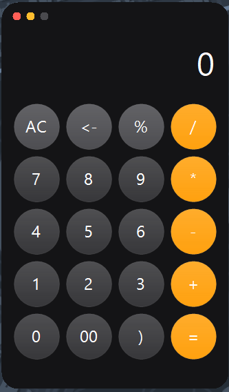

  

<h1 align="center">macOS Calculator for Windows</h1>

  A clean, lightweight calculator that brings the exact minimalist look and feel of Apple's macOS Calculator straight to Windows. 

  Completely free, standalone, and closed-source—no bloatware, no ads, and no tracking. Just launch it and go.

---

## 📸 Preview

  

---

## Testing

  

---

## ✨ Features

* **True macOS Look:** Features the exact dark interface, rounded buttons, and high-contrast orange operators you know and love.
* **Mistype-Proof & Distraction-Free:** Built entirely for mouse and touch inputs. It runs completely independent of your background typing, meaning you'll never have to worry about accidental calculation inputs or ghost numbers when bouncing between multiple active windows.
* **Made for Multitasking:** Perfect for keeping open on the side while you work, or for quick taps on touchscreen Windows devices without interrupting your main workflow.
* **Quality of Life Tweaks:** Adds a few extra productivity layout upgrades:
  * **Dedicated `00` Key:** Great for fast data entry and financial math.
  * **Visual `<-` Backspace:** Quickly erase single digits without having to clear your entire progress.
  * **Parenthesis Support:** Manage basic formula grouping cleanly right on the screen.
* **Zero Setup Required:** Run the standalone `.exe` instantly. No messy installation folders, registry clutter, or background services.

---

## 💻 System Requirements

* **Operating System:** Windows 10 or Windows 11 (64-bit)
* **Prerequisites:** .NET Desktop Runtime (Already pre-installed on most modern Windows PCs)
* **Storage:** Less than 50 MB

---

## 🚀 Download & Usage

1. Head over to the [Official V1.0.0 Release Page](https://github.com/Amcos-Windows/MacOS-Calculator-For-Windows/releases/tag/Calculator).
2. Download **`Macos_Calculator.exe`** from the Assets section.
3. Double-click the file to open it right up.
4. *Tip:* Right-click the app icon on your taskbar and hit **"Pin to taskbar"** so it's always one click away.

---

## 📄 License & Terms

This app is shared as free software. You're completely free to download, use, and share the compiled app for personal or commercial use. The underlying code is private and closed-source.

***

<em>Built natively with C# for Windows.</em>

